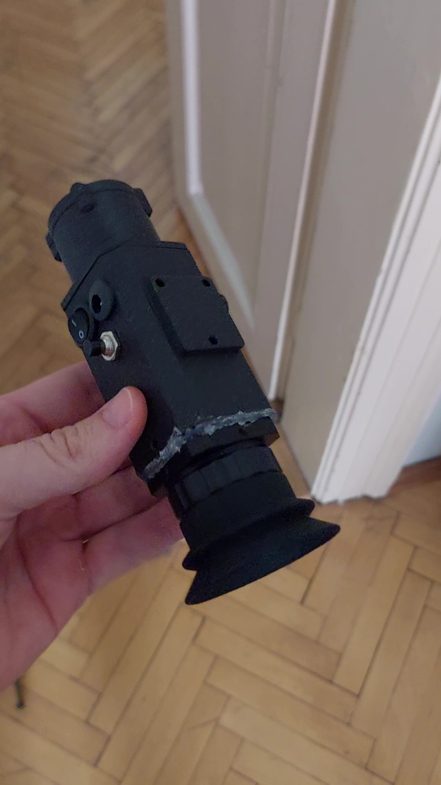

# Thermal monocular device - DIY

## Info

- **Author:** [Richard Husár]
- **Email:** [husarrichard@gmail.com]
- **GitHub:** [@xhusar2](https://github.com/xhusar2)
- **License:** See [LICENSE](LICENSE) file

## Intro

## BOM

See [Bill of Materials](docs/BOM.md) for complete parts list.

## Build steps

## Wiring

## Code 

## Troubleshooting

